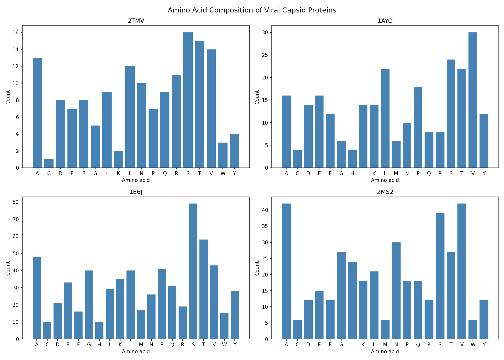
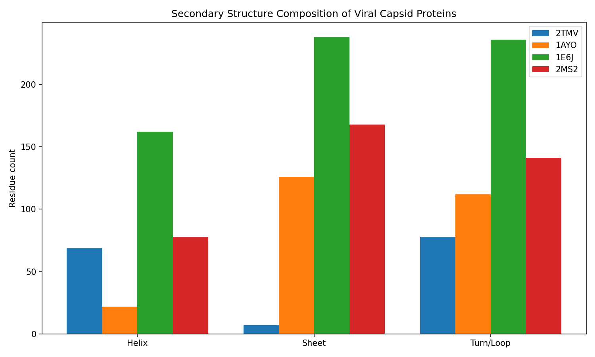

# Viral Capsid Protein Structural Analysis

Comparative structural analysis of viral capsid proteins using BioPython and Python.

## Viruses Analyzed
- **2TMV** — Tobacco Mosaic Virus
- **1AYO** — Adenovirus capsid protein
- **1E6J** — HIV-1 capsid domain
- **2MS2** — Bacteriophage MS2

## Methods
- Protein structure parsing via BioPython MMCIFParser
- Amino acid composition analysis
- Secondary structure assignment via DSSP
- Visualization with matplotlib

## Results
### Amino Acid Composition

### Secondary Structure

## Key Findings
- 2TMV is helix-dominated (alpha-helical capsid)
- 1AYO and 2MS2 are sheet-dominated (beta-barrel architecture)
- 1E6J shows mixed helix/sheet composition

## Requirements# viral-capsid-analysis
## How to Run
Open `capsid_analysis.ipynb` in Jupyter Lab and run all cells.

Comparative structural analysis of viral capsid proteins using BioPython
